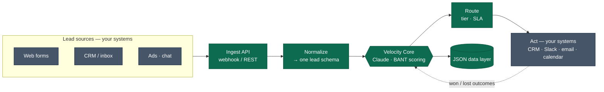
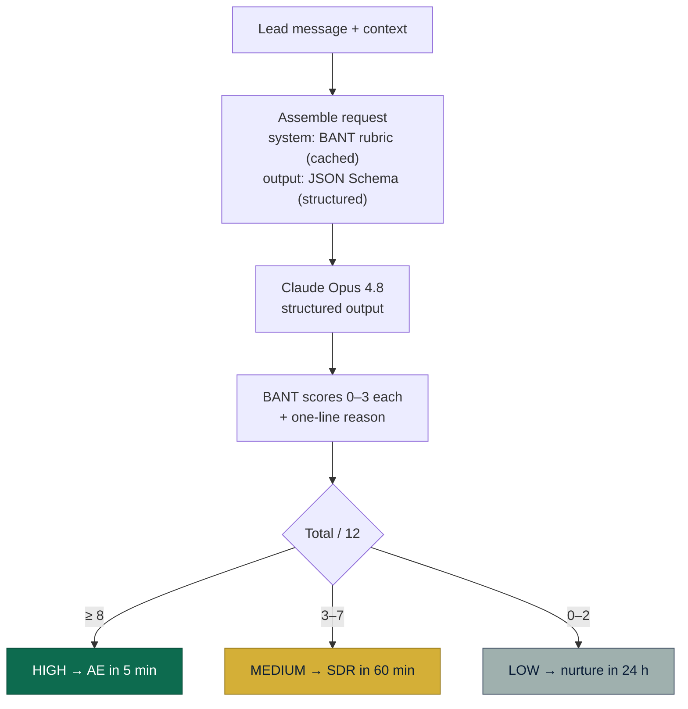
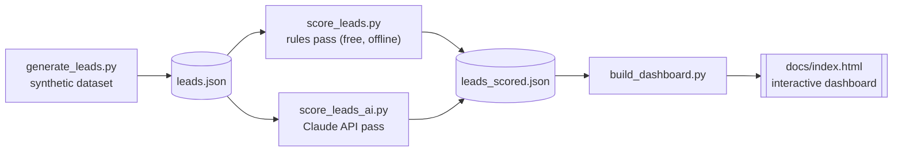

# Velocity Engine — AI Lead Intake & Prioritization

> An AI engine that reads every inbound lead the moment it lands, scores it on **BANT** (Budget · Authority · Need · Timeline), and routes it — turning a 42-hour, manual qualification process into one that responds to the best buyers in minutes.


This repository is a **self-contained, end-to-end demonstration** of an AI lead-scoring system: synthetic data → an AI scoring engine → a routing layer → an interactive executive dashboard. It runs offline for free (deterministic rules pass) or against the **Claude API** for real model-driven scoring.

It models a fictional company, **Cadence Workflow** — a ~120-person Series B B2B SaaS selling project-management software per-seat — where 3 SDRs and 4 AEs can't reach 400 monthly leads in time, so the best buyers go cold before anyone calls.

**🔗 Live demo:** *enable GitHub Pages on the `/docs` folder, then link your `https://<user>.github.io/velocity-engine/` URL here.*

---

## Table of contents

- [What it does](#what-it-does)
- [Results](#results)
- [Data architecture](#data-architecture)
- [How Velocity works (technical)](#how-velocity-works-technical)
- [Tech stack](#tech-stack)
- [Repository structure](#repository-structure)
- [Getting started](#getting-started)
- [The dashboard](#the-dashboard)
- [Data dictionary](#data-dictionary)
- [How a company adopts this](#how-a-company-adopts-this)
- [Notes & disclaimer](#notes--disclaimer)
- [About](#about)

---

## What it does

Inbound qualification is usually manual and outnumbered: leads arrive around the clock, the team works business hours, and the highest-intent buyers wait in a queue. Velocity removes the wait.

1. **Captures** every lead from any channel into one normalized record.
2. **Scores** each lead's own message on Budget, Authority, Need, and Timeline (0–3 each) — with a one-line reason for every score.
3. **Tiers & routes** it: high → an AE in minutes, medium → the SDR queue, low → an automated nurture track.
4. **Surfaces** the whole picture in an interactive dashboard executives can actually read.

The point the data makes is uncomfortable and deliberate: under the **as-is** process, **16 of 64 high-priority leads — buyers with budget, authority, and a deadline — were never contacted at all.**

---

## Results

Modeled on the synthetic dataset in this repo (400 leads, calibrated to a realistic broken baseline):

| Metric | As-is (manual) | Velocity (routed) | Delta |
|---|---|---|---|
| Average first response | ~42 hours | ~13 hours | **~3× faster** |
| Response to **high-priority** leads | ~28 hours | 5 minutes | **~330× faster** |
| Leads never contacted | 28% | 0% (all routed) | **−28 pts** |
| Priority tiers (emerged from messages, not labeled) | — | 16% High · 32% Medium · 52% Low | — |

> The "to-be" SLAs are conservative routing targets (High 5 min, Medium 60 min, Low 24 h). The "as-is" baseline is calibrated to a ~2,520-minute (≈42 h) mean with a long tail and ~28% never contacted — see [Data dictionary](#data-dictionary).

---

## Data architecture

The system is a small, transparent pipeline. The **engine in the middle is reusable**; the **edges are yours** — your channels flow in, your tools take the action out.



**Stages**

| Stage | Owner | What it does |
|---|---|---|
| Lead sources | You | Every inbound channel — forms, CRM, shared inbox, ads, demo bookings, chat |
| Ingest API | Engine | Captures each new lead via webhook / REST the moment it's created |
| Normalize | Engine | Maps messy inputs to one schema: `{source, role, company_size, region, message, timestamp}` |
| **Velocity Core** | Engine | Claude reads the message and returns a structured BANT score + reason |
| Route | Engine | Tier → action and response-time SLA |
| Act | You | CRM update, Slack/Teams alert, email/SMS, calendar booking (API / MCP) |
| Data layer | Engine | Plain JSON state; outcomes feed back to refine the rubric |

The data layer is intentionally just JSON ([`data/leads.json`](data/leads.json) → [`data/leads_scored.json`](data/leads_scored.json)) so the system drops into any stack without a migration.

---

## How Velocity works (technical)

Each lead takes the same path: assemble a request with a **fixed BANT rubric** and a **strict output schema**, send it to Claude, and get back a guaranteed-valid structured object that's tiered and routed.



### The request → response, per lead

**Request to Claude** (the system prompt holds a fixed rubric and is prompt-cached; the user message is the lead's own words):

```text
system:  BANT rubric (fixed) — how to score Budget/Authority/Need/Timeline 0–3
input:   lead.stated_need + {source, role, company_size, region}
output:  JSON Schema (structured outputs) → guaranteed valid object
```

**Structured response** (validated against a Pydantic model / JSON Schema):

```json
{
  "budget": 3,
  "authority": 3,
  "need": 3,
  "timeline": 3,
  "reason": "Approved budget for 120 seats, Q3 deadline, VP-level buyer."
}
```

→ `total 12/12 → HIGH → route to an AE in 5 minutes`

### Why it's built this way

- **Reads, doesn't keyword-match.** Claude Opus 4.8 interprets each lead's *intent* from natural language — "we've ring-fenced budget and need this before our busiest season" scores correctly even with no trigger words.
- **Structured outputs.** A JSON Schema (via Pydantic) guarantees a valid BANT object every call — no brittle parsing. ~$0.002 per lead; ~1 minute for 400 leads via concurrent requests.
- **Auditable by design.** One rubric lives in a single system prompt, and **every score carries a reason**, so a human can see *why* a lead was tiered the way it was.
- **Free, offline fallback.** A deterministic **rules engine** ([`src/score_leads.py`](src/score_leads.py)) mirrors the same BANT scoring with keyword heuristics — perfect for offline demos, CI tests, and zero-cost runs. The AI pass ([`src/score_leads_ai.py`](src/score_leads_ai.py)) is a drop-in upgrade producing the same schema.
- **Open at both ends.** A small Python core: webhooks / n8n in; CRM, Slack, email, and calendar out via each tool's API or MCP.

### Scoring pipeline (two interchangeable passes)



Both scorers write the **same** `leads_scored.json` shape, so the dashboard renders either one unchanged. Run the rules pass to see it instantly for free, then swap in the AI pass for real model scoring (the dashboard even shows the model's per-lead reasoning).

---

## Tech stack

| Layer | Technology |
|---|---|
| Core service | **Python 3** (standard library for the rules pass — no deps required) |
| AI scoring | **Anthropic Claude API** · **Claude Opus 4.8** (quality) / **Claude Haiku 4.5** (cost mode) |
| Output contract | **Structured Outputs** — Pydantic models + JSON Schema |
| Throughput | Concurrent scoring (`ThreadPoolExecutor`), prompt caching of the rubric |
| Integration (reference) | **n8n** / webhooks in; CRM, Slack, email, calendar out via API / **MCP** |
| Data layer | Plain **JSON** (`leads.json` → `leads_scored.json`) |
| Presentation | Single self-contained **HTML** dashboard — inline SVG/CSS/JS, **zero external dependencies**, brand-themed |

---

## Repository structure

```
velocity-engine/
├── README.md
├── LICENSE
├── requirements.txt          # only needed for the Claude API pass
├── .gitignore
├── src/
│   ├── generate_leads.py     # synthetic, calibrated 400-lead dataset
│   ├── score_leads.py        # RULES pass — deterministic BANT, free & offline
│   ├── score_leads_ai.py     # AI pass — Claude API + structured outputs
│   └── build_dashboard.py    # renders the interactive dashboard from scored data
├── data/
│   ├── leads.json            # raw synthetic leads
│   └── leads_scored.json     # leads + BANT scores + tiers + SLAs
└── docs/
    └── index.html            # the interactive dashboard (GitHub Pages-ready)
```

---

## Getting started

> All commands run from the repository root.

### Option A — Rules pass (free, offline, no dependencies)

```bash
python src/generate_leads.py     # writes data/leads.json
python src/score_leads.py        # writes data/leads_scored.json
python src/build_dashboard.py    # writes docs/index.html

# open the dashboard
open docs/index.html             # macOS  (use 'start' on Windows / 'xdg-open' on Linux)
```

### Option B — AI pass (real Claude scoring)

```bash
pip install -r requirements.txt
export ANTHROPIC_API_KEY=sk-ant-...

python src/score_leads_ai.py --limit 5     # cheap smoke test first (~free)
python src/score_leads_ai.py               # score all 400 (~$0.90 Opus / ~$0.18 Haiku)
python src/build_dashboard.py              # rebuild the dashboard with AI scores
open docs/index.html
```

Useful flags on the AI pass: `--model claude-haiku-4-5` (cheaper), `--limit N` (test subset), `--concurrency N`.

---

## The dashboard

A single, self-contained `docs/index.html` (no build step, no CDN — renders offline). It's a scrollytelling executive narrative:

- **Hero & the problem** — animated KPIs: 400 leads vs. 7 people, off-hours volume, hours-to-reply.
- **The as-is process** — an interactive **response-time distribution** that exposes the broken long tail.
- **The cost** — the high-intent buyers ignored entirely.
- **The engine** — an interactive **lead explorer**: click any real lead to see its live BANT breakdown, reason, and routing SLA.
- **Under the hood** — the **animated data-architecture schematic** (flowing data packets, glowing AI core, feedback loop) plus the request → response and tech stack.
- **The transformation** — a **Today ⇄ Velocity toggle** that morphs every number live.
- **The blueprint & rollout** — how a company plugs in its own systems, and a 3-week go-live timeline.
- **The payoff** — the headline impact.

**Host it free:** push this repo, then enable **GitHub Pages → Deploy from branch → `/docs`**.

---

## Data dictionary

`data/leads.json` — array of 400 lead objects under `{ "_meta": {...}, "leads": [...] }`.

| Field | Type | Description |
|---|---|---|
| `lead_id` | string | `L0001`–`L0400` |
| `created_at` | string | ISO 8601 timestamp, spread across one calendar month (incl. evenings/weekends) |
| `source` | enum | `demo_request` · `free_trial` · `content_webinar` · `paid_ad` · `referral` |
| `company_size_band` | enum | `solo` · `small` · `mid` · `large` · `enterprise` |
| `contact_role` | enum | `junior` · `manager` · `director` · `vp` · `c_level` · `owner` |
| `region` | string | Country / region |
| `stated_need` | string | The lead's own 1–2 sentence message (the signal that gets scored) |
| `as_is_first_response_minutes` | int \| null | Minutes to first reply under the manual process; `null` if never contacted |
| `as_is_contacted` | bool | Whether the lead was ever contacted |

After scoring, `leads_scored.json` adds: `bant {budget, authority, need, timeline}`, `bant_total` (0–12), `priority` (`high`/`medium`/`low`), `to_be_first_response_minutes`, and — on the AI pass — `bant_reason`.

**Calibration targets** (so readers know the data is modeled, not real):

- Source mix: demo 25% · trial 30% · webinar 25% · ad 15% · referral 5%
- Intended priority spread: ~15% high / ~35% medium / ~50% low (emerges from the messages, not labeled)
- As-is mean first response: ~2,520 min (≈42 h), long-tailed; ~30% never contacted
- Source correlates with quality: demo/referral skew senior, larger, higher-intent; webinar/ad skew lower-intent

---

## How a company adopts this

The engine is the reusable core; you bring the edges. Typical rollout is ~3 weeks with no rip-and-replace:

| Phase | What happens | You walk away with |
|---|---|---|
| **Week 1 — Connect & map** | Wire up channels (webhooks / native), map fields to the schema, import 3–6 months of history | Every lead in one clean stream |
| **Week 2 — Calibrate** | Define your BANT rubric in plain English; score your history; tune tiers against known won/lost | A model validated on *your* outcomes |
| **Week 3 — Route & go live** | Wire actions into CRM/Slack/calendar, set SLAs, shadow-run, then switch on | Hot leads to the right rep in minutes |
| **Ongoing** | Weekly review; outcomes feed back to refine the rubric | Compounding accuracy, near-zero manual effort |

---

## Notes & disclaimer

- **The data is 100% synthetic.** Cadence Workflow is fictional; no real persons, companies, or contact details are represented. The dataset is generated and calibrated for demonstration only.
- The numbers in this README are produced from the committed dataset and will reproduce exactly (`generate_leads.py` uses a fixed random seed).
- The Claude API pass costs a small amount per run against your own API key; the rules pass is free and requires no key or dependencies.

---

## About

Built by **Acey Magallanes** as part of **AceLiora AI** — an AI automation studio helping SMEs turn manual, leaky processes into fast, measurable, automated systems.

> *Accelerate Change. Sustain Excellence.*

## License

[MIT](LICENSE) © 2026 Acey Magallanes
